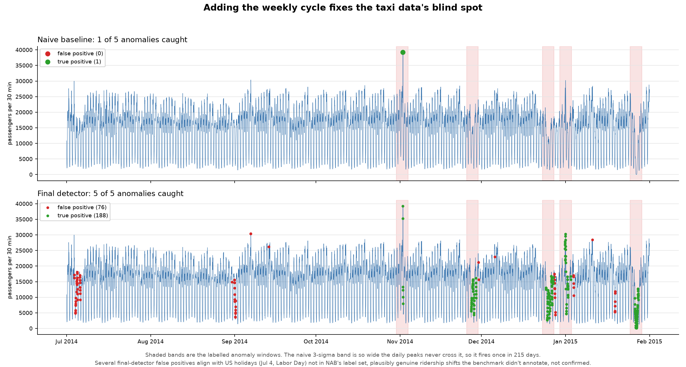
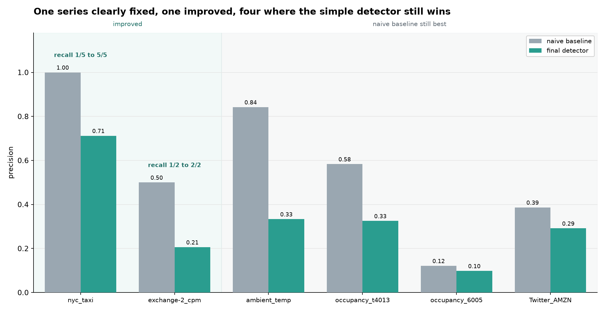

# Seasonal Anomaly Detection: When "Learn the Normal Pattern First" Doesn't Automatically Work

I built this project to test whether adding seasonal awareness fixes a naive anomaly detector. The honest answer is: sometimes, and working out exactly when turned out to matter more than the win itself.

A naive threshold fails on seasonal time series two different ways: it over-alerts on ordinary daily peaks, or the seasonal swing itself corrupts the threshold until it stops firing at all. Seasonal decomposition fixes the second failure on the one series with enough data to support it, and makes almost everything else worse. On four of six series tested, nothing built here beats the naive baseline.

## Data

Six real series from the Numenta Anomaly Benchmark (NAB), a public benchmark of labelled real-world time series (MIT license, github.com/numenta/NAB, pinned commit ea702d7), picked after actually plotting daily and weekly autocorrelation across all 58 series, not by assumption:

- nyc_taxi: taxi ridership, strong daily and weekly cycle, 5 labelled anomalies
- ambient_temperature_system_failure: daily cycle on a slow multi-month drift, 2 anomalies
- exchange-2_cpm_results: ad exchange traffic, clean daily cycle, 2 anomalies
- occupancy_t4013 and occupancy_6005: traffic sensors, sharp commute peaks, real data gaps, 2 and 1 anomalies
- Twitter_volume_AMZN: a weak diurnal cycle buried under bursty spikes, 4 anomalies, the deliberately hard case

Evaluation uses a simplified time-tolerant scoring (a detection counts if it falls in or near a labelled window), not NAB's full weighted scoring methodology.

## The naive baseline fails two different ways

A static 3-sigma threshold over-alerts on the traffic and ad-exchange series, since the daily rush-hour peak trips it every day. On nyc_taxi it does the opposite: the daily swing is so large it inflates the detector's own scale estimate until it stops firing, catching only 1 of 5 real anomalies in 215 days.



## Seasonal decomposition made things worse, for three specific reasons

Applying STL decomposition and thresholding the residual instead of the raw value lowered precision on every one of the six series. Three separate, measured causes:

- A real weekly cycle survived in the residual on nyc_taxi and ambient_temperature, so weekends became systematic false positives (7-day residual autocorrelation of 0.78 and 0.38).
- The residual is heavy-tailed and its spread isn't constant (excess kurtosis from 5 to 1276 across series), so one global sigma is too tight during bursty stretches.
- On ambient_temperature, where the naive baseline already worked well, the residual band shrank roughly fourfold, so ordinary weekend swings started crossing a much tighter line.

I tested two fixes separately rather than bundled, since bundling them would have hidden which one actually worked. Adding a weekly seasonal component (MSTL) fixed nyc_taxi outright, but overfit badly on short series (under 10 weekly cycles), in one case absorbing the labelled anomaly itself into the seasonal pattern. A 10-cycle data-sufficiency rule fixed that. A robust local scale (rolling MAD) backfired on every series: on these heavy-tailed residuals, the standard MAD-to-sigma conversion comes out to only 20 to 49 percent of the true standard deviation, so a threshold calibrated for a normal distribution floods false positives. Wider thresholds (k = 6 through 9, tested uniformly, not per series) never beat a plain global standard deviation.

## The final result

The final detector: fit a weekly seasonal component only with enough data (10+ cycles), otherwise daily-only decomposition, still a fixed global threshold, no per-series tuning.



One series clearly fixed (nyc_taxi), one improved at a precision cost (exchange-2_cpm), four where the original naive detector from the first phase is still the best result anywhere in the project.

## What this actually shows

A more sophisticated model isn't automatically better. Seasonal decomposition helped exactly where its assumptions held (enough data for a stable weekly pattern, a residual that isn't dominated by bursts) and hurt everywhere they didn't. The useful output here isn't the detector, it's knowing which series had enough structure to support which method, and being willing to report that the simplest approach still wins on most of the data.

## Limitations

- Six series out of NAB's 58; the four unsolved series may not represent every failure mode in the full benchmark.
- Simplified time-tolerant scoring, not NAB's full weighted methodology.
- Batch analysis over complete series, not true online/streaming evaluation.
- The local MAD scale was tested at four discrete k values, not a continuous search; a working calibration may exist outside that range.
- No machine-learning-based method was tried; this stayed within classical, explainable decomposition.

## Repository structure

```
src/detectors/    naive threshold, STL, MSTL, local MAD scale detectors
src/analysis/     baseline runs, ablation, seasonality exploration, README figures
src/evaluation/   time-tolerant scoring against labelled windows
data/raw/         NAB data, not tracked, see data/README.md for fetch script and attribution
reports/figures/  the two README figures (tracked); other scratch plots gitignored
```

## Running it

```bash
python -m venv .venv
source .venv/bin/activate
pip install -r requirements.txt
bash scripts/fetch_data.sh
python -m src.analysis.explore_seasonality
python -m src.analysis.run_naive_baseline
python -m src.analysis.run_stl_baseline
python -m src.analysis.compare_naive_vs_stl
python -m src.analysis.run_ablation
python -m src.analysis.run_phase5
python -m src.analysis.make_readme_figures
```

Data: Numenta Anomaly Benchmark (Lavin & Ahmad, 2015), MIT licensed, github.com/numenta/NAB.
